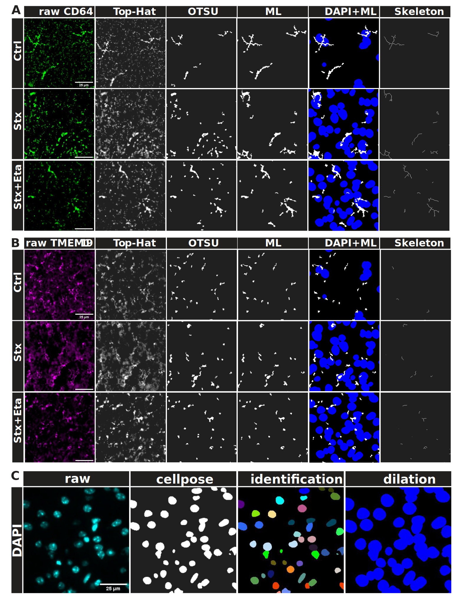

# Immune Cell Segmentation & Shape Analysis

<h3 align="center">
Immune Cell Segmentation & Shape Analysis is an open-source Snakemake workflow that allows analysis of cell shapes after segmentation using user defined pytorch models.
</h3>

### Installation 

1. Install miniconda following the [installation instructions](https://docs.conda.io/en/latest/miniconda.html).
2. Start the Anaconda Prompt.
3. Navigate to the analysis folder `cd path/to/folder`.
4. Create the python environment and install the required packages by calling:
   1.  ```conda env create -f environment_gpu.yml``` for the prefered GPU version 
   2.   ```conda env create -f environment.yml``` for CPU version[^1].

[^1]: Using the CPU will result in a considerable slowdown of the machine learning segmentation step.

## Executing the Analysis
1. Merge images of different markers from the same image section into one TIFF file, formated as CYX with named channels as C.
1. Insert the merged images into the input folder.
2. Adjust parameters in the config/config.yml file.
   1. Declare cell marker channel names under "target" as a list.
   2. Declare the DAPI channel name under "registration".
   3. Under "ml_segmentation" declare an input with the same name as in target for each target marker and define the model_name, config, checkpoint and a cutoff_value. (model_name "default" will result in using a pretrained model)
3. Open a Terminal application and navigate to the folder
4. Activate the python environment with `conda activate immune_gpu` (or immune for CPU)
5. Type `snakemake -c all --snakefile ./workflow/Snakefile`.

## Analysis steps
| Rule              | Output                                                                                                                   |
| ----------------- | ------------------------------------------------------------------------------------------------------------------------ |
| Top Hat           | Contrast stretched and white tophat image                                                                                |
| DAPI Segmentation | Cellpose segmentation of DAPI channels for registration                                                                  |
| Otsu Segmentation | Otsu segmentation of marker images for model training                                                                    |
| ML Segmentation   | Deep learning model segmentation of marker images for shape analysis                                                     |
| Registration      | Registering all segmented marker images with dilated DAPI                                                                |
| Skeletonization   | Skeletonizing DAPI positive marker images                                                                                |
| Branch Counter    | Counts branches, endpoints and branchpoints of skeletonized images                                                       |
| Longest Path      | Determines the length of the direct path between the two endpoints with the highest eccentricity of skeletonized images  |
| Cell area         | Determines the number of pixels of registered markers                                                                    |
| Nearest Neighbor  | Computes the distance to the nearest neighbor and number of neighbors in set distances for cells in the registered image |
## Example processing
<p align="center">
  
</p>

## Correspondence
[**Prof. Dr. Daniel R. Engel**](mailto:danielrobert.engel@uk-essen.de): Department of Immunodynamics, Institute of Experimental Immunology and Imaging, University Hospital Essen, Essen, Germany http://www.immunodynamics.de
[**Dr. Jianxu Chen**](mailto:jianxu.chen@isas.de): Leibniz-Institut für Analytische Wissenschaften-ISAS-e.V., Dortmund, Germany.

